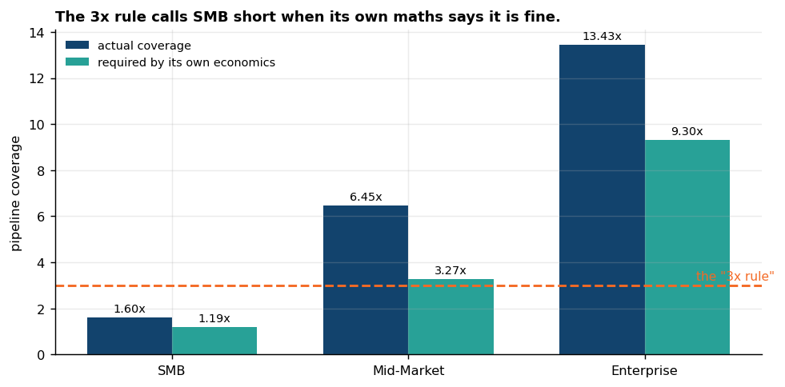
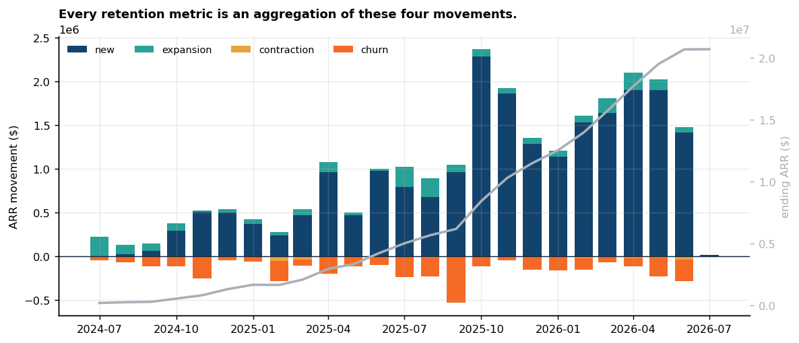
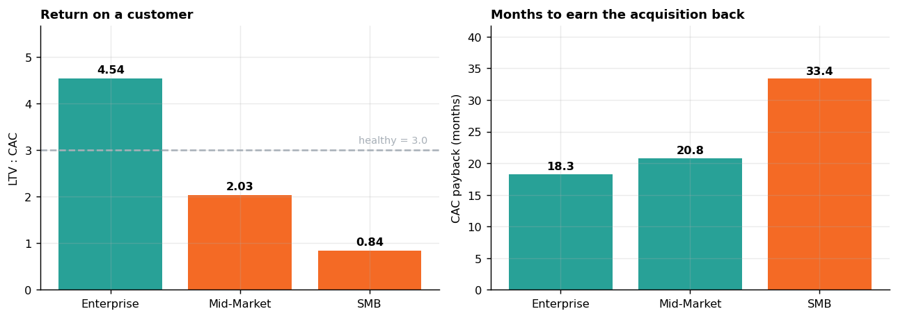

<h1>📈 Marketing Attribution & Incrementality</h1>

### *Every attribution argument I have sat through was unfalsifiable, because nobody in the room knew the right answer. So I built a dataset where I do.*

[](https://github.com/KushPatel29/marketing-attribution-analytics/actions/workflows/ci.yml)


**▶ Live demo — [attribution-vs-truth.streamlit.app](https://attribution-vs-truth.streamlit.app)**

---

## What this is, in one paragraph

Marketing attribution is the only analytics discipline I know of where the
industry argues endlessly about the answer and **nobody can check it**. The
reason is simple: the counterfactual — *would this customer have bought anyway?*
— is not in the data. So this project starts by generating a world where it
**is**. Every channel's true causal contribution is known exactly, six
attribution models are then graded against it, and a geo holdout is run to see
what an actual experiment recovers. A second act asks all the same questions of
a **B2B SaaS go-to-market motion**, where revenue recurs and a conversion takes
months — which is where most of the metrics a revenue team lives on come from.

All data is synthetic and generated from fixed seeds. No real company, customer,
campaign, or spend figure appears anywhere.

<table>
<tr><td width="33%" valign="top">

### 🎯 Act one
**14,000** user journeys
**50,282** sessions
**101,879** funnel events

E-commerce attribution, graded against a planted ground truth.

</td><td width="33%" valign="top">

### 🧪 The experiment
**20** geos, **1.77M** sessions
**8+8** weeks

A geo holdout, because no observational model could recover the truth.

</td><td width="33%" valign="top">

### 💼 Act two
**2,600** accounts
**3,216** opportunities
**14,940** stage records

A B2B SaaS motion: pipeline, ARR, quota, PLG.

</td></tr>
</table>

---

## The three findings

> ### 1. Last-touch gives `direct` a quarter of all conversions. Its true share is 1.9%.
> A **13-fold** overcredit, on a channel nobody can buy — because "direct" is not
> a channel, it is a label for demand that something else created.

> ### 2. No attribution model recovers the truth, and the sophisticated ones lose to a heuristic.
> An exact Shapley value and a Markov chain both finish behind a 40/20/40 split
> you can write in a `CASE` expression. The reason is structural, not fixable,
> and it is the most useful thing in this repo.

> ### 3. The best-run segment in the SaaS business is the one that loses money.
> SMB has the fastest sales cycle, the highest win rate and the healthiest
> pipeline coverage — and an **LTV:CAC of 0.84**.

---

## Contents

**Act one — e-commerce attribution**
&nbsp;&nbsp;[Making the unanswerable answerable](#making-the-unanswerable-answerable) ·
[The planted trap](#the-planted-trap) ·
[What the models got wrong](#what-the-models-got-wrong) ·
[Why they cannot win](#why-they-cannot-win) ·
[The nuance I refuse to drop](#the-nuance-i-refuse-to-drop) ·
[The part that measures causality](#the-part-that-actually-measures-causality) ·
[Why even a perfect model is wrong](#why-even-a-perfect-model-would-be-wrong) ·
[Funnel and cohorts](#the-rest-of-the-analysis)

**Act two — B2B SaaS go-to-market**
&nbsp;&nbsp;[Why a second act](#act-two--the-same-questions-asked-of-a-b2b-saas-motion) ·
[Pipeline and the 3× rule](#the-pipeline-and-the-rule-everyone-quotes-wrong) ·
[Retention](#net-and-gross-retention-on-the-same-row) ·
[The interview finding](#the-finding-id-lead-an-interview-with) ·
[Where the two acts collide](#where-act-one-and-act-two-collide) ·
[Product-led motion](#the-product-led-motion) ·
[Semantic layer](#the-semantic-layer)

**How it is built**
&nbsp;&nbsp;[The SQL is the deliverable](#the-sql-is-the-deliverable) ·
[Bugs the tests caught](#two-bugs-the-tests-caught) ·
[Run it](#run-it) ·
[What I deliberately didn't build](#what-i-deliberately-didnt-build)

---
---

# Act one — e-commerce attribution

## Making the unanswerable answerable

Last-touch says paid search won. First-touch says display won. The agency's
Markov model says whatever justifies the retainer. All three are unfalsifiable,
because you cannot rerun a customer's life with one channel removed.

Unless you built the customer.

Each user's conversion here is drawn from a **noisy-OR** over the channels that
actually touched them:

```
p(convert) = 1 − (1 − baseline) × ∏  (1 − liftᶜ) ^ min(touchesᶜ, cap)
                                  c
```

Every user is issued **one uniform random draw `u`** and converts when `u < p`.
Then — holding *that same draw fixed* — I recompute `p` with one channel's
touches deleted and ask whether the user still converts.

The ones who stop converting are that channel's true incremental contribution.

That is the experiment no marketing team can run on live traffic. Here it costs
four seconds of CPU, and it turns every model below from a matter of opinion
into something with a score.

## The planted trap

One row in [`config.py`](config.py) does most of the work:

| channel | true lift | opens journeys | closes journeys |
|---|:---:|:---:|:---:|
| `paid_search` | 0.055 | often | very often |
| `email` | 0.045 | rarely | often |
| `organic_search` | 0.035 | often | sometimes |
| `affiliate` | 0.030 | rarely | sometimes |
| `paid_social` | 0.020 | very often | rarely |
| `display` | 0.010 | very often | almost never |
| **`direct`** | **0.005** | **rarely** | **most of all** |

`direct` has the **highest closing weight and the lowest causal effect**. That
is not a quirk of the simulation; it is the single most common misreading in
real marketing data. Somebody sees the ad on Tuesday and types the URL on
Friday, and Friday gets the credit.

Everything that follows is a consequence of that one row.

## What the models got wrong


<sub>*The live console. Pick any models; the accuracy and budget tables follow.*</sub>


| model | mean error (share points) | rank correlation with truth |
|---|:---:|:---:|
| 🥇 **Position-based (40/20/40)** | **5.76** | **0.64** |
| Shapley value *(exact, 128 coalitions)* | 6.30 | 0.50 |
| Linear | 6.35 | 0.57 |
| Markov removal effect | 6.97 | 0.14 |
| First-touch | 7.71 | 0.39 |
| ❌ Last-touch | 8.82 | 0.18 |

**Nothing recovers the truth, and the two sophisticated models lose to a
heuristic.** The exact Shapley value comes fourth. The Markov chain comes fifth,
and its rank correlation of **0.14** means it barely orders the channels better
than chance would.

I did not expect that. I spent a while looking for the bug. There isn't one.

## Why they cannot win

> **Every observational model reads how often a channel is *present*. None of
> them can see whether it *caused* anything.**

In this data, presence and effect are deliberately decoupled — display is
everywhere and does almost nothing; email is rare and does a lot. A model whose
only input is the journey log cannot tell those apart, no matter how much
mathematics you put on top.

Markov's removal effect fails hardest precisely *because* it is the most
confident about causality. Deleting a high-volume node tears a lot of paths out
of the graph, so display and direct score high on removal effect for exactly the
same reason they score high on last-touch: there is simply a lot of them.


`direct` closes **63%** of its own touches. `display` closes **3%** of its 1,275.
Neither number has anything to do with what they contributed.

## The nuance I refuse to drop

Last-touch is the worst model in the table. It is also — if you only use it to
split **paid** budget — the *least* damaging:

| model | paid budget misallocated | % of budget |
|---|---:|---:|
| **Last-touch** | **$5,802** | **15.6%** |
| Position-based | $6,494 | 17.5% |
| Shapley | $7,576 | 20.4% |
| Linear | $7,723 | 20.8% |
| Markov | $8,320 | 22.4% |
| First-touch | $11,349 | 30.5% |

Last-touch's catastrophic error lands on `direct` — and you cannot buy direct.
Strip the unbuyable channels out and the model that looks worst on paper
misallocates the least real money.

Both numbers are here because reporting only the first one is how you win an
argument and lose the decision. A test
([`test_last_touch_ranks_better_on_budget_than_on_share`](tests/test_attribution.py))
keeps it honest.

## The part that actually measures causality

If no observational model can see causality, you have to go and create some.

**A geo holdout.** Paid search switched off in 10 of 20 DMA-style geos for eight
weeks, against an eight-week pre-period. 1.77M sessions.


| estimator | result | vs. the planted truth of 5.50% |
|---|---|---|
| Naive pre/post on the holdout | **11.00%** | 2× overstated ❌ |
| **Difference-in-differences (within-geo)** | **4.04%** · 95% CI **2.05 – 6.08%** | **interval covers the truth** ✅ |

The naive readout is not a strawman — it is what gets presented. Both arms fell
together on a seasonal downswing, and comparing the holdout only to its own past
charges all of that to the channel.

Three decisions carry the readout, and each one is a test:

1. **Power was computed before the result, not after.** At this traffic the test
   can detect a 2.99% relative lift. Paid search (5.5%) is testable.
   **Paid social is not** — its effect is 8 basis points on the conversion rate,
   needing ~967,000 sessions per arm. The repo says so out loud rather than
   running the test and reporting a null as a finding.
2. **Normalise within geo before comparing arms.** Geos differ in baseline
   conversion by more than the effect being measured; pooling raw rates buries a
   5% signal under a 40% spread in geo quality.
3. **Bootstrap over geos, not sessions.** The geo is the randomised unit.
   Resampling sessions would pretend 6,000 sessions in one geo are 6,000
   independent decisions. The consequence — that you widen a geo test by adding
   *geos*, not traffic — is itself a test.

And the estimator is validated in both directions: it recovers a planted 8%
effect, and when there is **no** effect it returns nothing and its interval
covers zero. *A method you have only ever seen find something is not a method.*

## Why even a perfect model would be wrong

Incremental credit **does not sum to the number of conversions**. A customer who
needed both the email and the paid-search click is incremental for *both* —
removing either one alone loses the sale. Attribution models must split each
conversion into shares totalling 100%, so they are answering a subtly different
question than the business is asking.

That gap is irreducible. It is why
[`test_no_model_is_suspiciously_perfect`](tests/test_attribution.py) asserts a
**floor** on the error: a model scoring near zero would mean the ground truth had
leaked into the harness, not that someone had built something brilliant.

## The rest of the analysis

The attribution story is the headline, but a marketing analyst spends most of
the week on the funnel and the cohorts.


| step | sessions | step conversion |
|---|---:|---:|
| session_start | 50,282 | — |
| product_view | 31,829 | 63.3% |
| add_to_cart | 11,936 | 37.5% |
| checkout_start | 6,311 | 52.9% |
| purchase | 1,521 | 24.1% |

Cut by device, **one** step moves and the others don't: cart → checkout runs
**46.8% on mobile against 61.8% on desktop — 15.1 points, on the majority of the
traffic.** That is a product bug with a revenue number attached, and it is the
kind of finding a funnel exists to produce.


Cohorts are cut by first-order month, with a retention triangle and a cumulative
revenue-per-customer curve, both computed with window functions in
[`sql/03_cohorts_ltv.sql`](sql/03_cohorts_ltv.sql).

---
---

# Act two — the same questions, asked of a B2B SaaS motion

Everything above is e-commerce, where a session converts or it doesn't and the
money arrives once. **A SaaS go-to-market breaks both assumptions**, and almost
every metric a revenue team actually runs on exists *because* of the difference:

- **Revenue recurs**, so what matters is not what one customer paid but what the
  whole book did — new, expansion, contraction, churn. That is why the second
  dataset writes an **ARR movement ledger** rather than an order table.
- **A conversion is not an event.** It is a months-long opportunity walking
  through stages, owned by a rep carrying a quota. That is why opportunities
  carry a **stage history** — without it you cannot compute stage conversion or
  cycle length, and those two are most of pipeline diagnosis.

Field names follow Salesforce conventions (`is_closed`, `is_won`, `stage_name`,
`amount_arr`, `loss_reason`) so the SQL reads the way it would against a real org
rather than against a shape invented for this repo.

## The pipeline, and the rule everyone quotes wrong

| stage | opportunities | stage conversion |
|---|---:|---:|
| Prospecting | 3,216 | — |
| Discovery | 3,122 | 97.1% |
| Demo | 2,545 | 81.5% |
| Proposal | 1,942 | 76.3% |
| Negotiation | 1,334 | 68.7% |

Everyone manages pipeline to **"3× coverage."** Three is a blended heuristic
borrowed from a transactional motion. The coverage a segment actually needs
falls out of two numbers it already has:

```
required coverage  =  ( 1 ÷ win rate )  ×  ( sales cycle ÷ days in a quarter )
```

The first term is how much pipeline a win consumes. The second is how many
quarters must already be in flight, because a deal taking 131 days to close
cannot be sourced inside the quarter it lands in.



| segment | win rate | cycle | actual | **required** | verdict | the 3× rule says |
|---|---:|---:|---:|---:|:---:|:---:|
| SMB | 30.3% | 32d | 1.60× | **1.19×** | ✅ covered | ❌ **short** |
| Mid-Market | 24.6% | 72d | 6.45× | 3.27× | ✅ covered | ✅ covered |
| Enterprise | 16.3% | 131d | 13.43× | **9.30×** | ✅ covered | ✅ covered |

**The blended rule gets SMB backwards** — nagging a team whose pipeline is
genuinely fine — and it would have blessed an Enterprise book at 3× when that
segment needs more than nine. Both verdicts ship side by side rather than one
quietly replacing the other, and a test fails if they ever agree everywhere.

One more thing the stage history says: the slowest Enterprise stage is
**Prospecting, at 50 days** — not Negotiation. The bottleneck is getting in the
room, not closing.

## Net and gross retention, on the same row



| segment | NRR | GRR | logo churn | dollar churn |
|---|---:|---:|---:|---:|
| Enterprise | **103.9%** | 83.8% | 17.9% | 14.4% |
| Mid-Market | 85.0% | 70.5% | 30.1% | 28.4% |
| SMB | 60.5% | 53.6% | 47.6% | 42.7% |

NRR counts expansion; GRR does not. Enterprise posts **above 100% net retention
while losing 16% of its ARR gross** — expansion papers over it. Quoting only NRR
is how a board gets a comfortable answer to a question it didn't ask, so both are
computed from the same ledger and a test enforces NRR ≥ GRR.

Logo churn and dollar churn diverge in every segment, because churn concentrates
in small accounts. They are different numbers with different owners.

## The finding I'd lead an interview with



| segment | CAC | payback | LTV:CAC | verdict |
|---|---:|---:|---:|:---:|
| Enterprise | $224,810 | 18.3 mo | **4.54** | ✅ healthy |
| Mid-Market | $57,359 | 20.8 mo | 2.03 | ⚠️ thin |
| **SMB** | $26,151 | **33.4 mo** | **0.84** | ❌ **loses money** |

**SMB has the fastest sales cycle, the highest win rate, and the healthiest
pipeline coverage in the business — and it does not pay back.** It absorbs the
largest share of marketing spend (55% of leads), converts it into the smallest
deals, and then churns 42.7% of those dollars every year.

Every operational metric says SMB is the best-run segment. The unit economics say
it should probably not exist. That gap is the whole argument for putting cost and
retention on the same page as the pipeline dashboard.

> **A modelling note, because it nearly hid this.** Allocating S&M cost by each
> segment's *share of ARR* makes CAC proportional to deal size and forces every
> segment to the **same** payback period by construction. Sales cost follows
> headcount and marketing follows lead volume instead — neither of which is
> downstream of the answer. A test asserts the three paybacks are not identical.

## Where act one and act two collide

CAC payback, the magic number and LTV:CAC all have marketing spend in the
denominator. Which means the attribution model chosen in act one is **not** a
marketing-team methodology argument — it silently decides which channel looks
efficient enough to fund. So channel CAC is computed **once per model**:

| model | says cheapest is | CAC | agrees with truth |
|---|---|---:|:---:|
| **TRUTH (incremental)** | **display** | $12,053 | — |
| Last-touch | display | $5,700 | ✅ |
| First-touch | affiliate | $12,432 | ❌ |
| Linear | affiliate | $14,862 | ❌ |
| Shapley | affiliate | $16,069 | ❌ |
| Markov | affiliate | $16,522 | ❌ |
| Position-based | affiliate | $16,589 | ❌ |

**Five of six models would have you defund the channel that is actually
cheapest.** The one that agrees — last-touch, the worst model in act one — gets
there for the wrong reason: it *undercredits* display so severely that it
allocates almost no budget to it, which makes its cost per acquisition look
brilliant.

A right answer produced by a broken mechanism is not a right answer. That table
is why act one's error metric and act two's dollar consequence belong in the same
repository.

CAC is computed for **paid channels only**. Allocating budget to organic or
direct and calling the result a cost per acquisition invents a price for
something nobody bought — and it is exactly where *"direct is our cheapest
channel"* comes from. A test enforces it.

The **magic number** averages 0.66 and reaches 0.97 in the latest quarter. It is
deliberately *not* multiplied by four: the textbook formula annualises a
quarterly revenue delta, and net new ARR is already an annual figure. Applying
the ×4 anyway inflates the ratio fourfold, and is how a mediocre business ends up
reporting a magic number of 8.

## The product-led motion

| step | accounts | conversion |
|---|---:|---:|
| signup | 1,060 | — |
| activated | 563 | 53.1% |
| product-qualified | 160 | 28.4% |
| became an opportunity | 136 | 85.0% |

Product-qualified accounts win at **40.4%** against **26.0%** sales-led, on a
shorter cycle.

The caveat is stated rather than buried: **self-serve accounts self-select**, so
the observed gap overstates the causal one. This is the same problem act one
spent an entire geo holdout solving, and the honest answer here is that nobody
randomised anything — so that number is a comparison, not an effect.

## The semantic layer

[`looker/`](looker/) defines the metrics once, in LookML — win rate, ACV, sales
cycle, NRR, GRR, activation rate, time-to-value. It is committed as
**configuration rather than shown as a screenshot**, because configuration can be
tested: the suite parses every view, checks each `sql_table_name` resolves to a
table this repo actually produces, and checks every `${TABLE}.column` exists.

The definition it exists to protect:

```lkml
measure: win_rate {
  type: number
  sql: 1.0 * ${won_opportunities} / NULLIF(${closed_opportunities}, 0) ;;
}
```

Denominator is **closed** deals. A raw `AVG(is_won)` silently puts open deals in
the denominator and understates the number all quarter — the most common wrong
metric on a sales dashboard. A test fails if anyone replaces it with an average.

---
---

# How it is built

## The SQL is the deliverable

Everything in `sql/` runs **as written** against SQLite.
[`engine/run_analytics.py`](engine/run_analytics.py) loads the CSVs and calls
`executescript` on those exact files — there is no Python re-implementation that
happens to resemble them. A test
([`test_committed_sql_is_what_runs`](tests/test_sql_analytics.py)) fails if any
exported table stops being created by a `CREATE TABLE` in `sql/`.

| file | what it does |
|---|---|
| [`01_schema.sql`](sql/01_schema.sql) | Reference DDL for the star |
| [`02_funnel.sql`](sql/02_funnel.sql) | Funnel with `LAG` step conversion, by device and entry channel |
| [`03_cohorts_ltv.sql`](sql/03_cohorts_ltv.sql) | Cohorts, retention triangle, cumulative LTV via window frames |
| [`04_channel_efficiency.sql`](sql/04_channel_efficiency.sql) | Spend, CPA, ROAS — aggregate-then-join |
| [`05_attribution_heuristics.sql`](sql/05_attribution_heuristics.sql) | First / last / linear / position-based, one pass |
| [`06_pipeline.sql`](sql/06_pipeline.sql) | Stage funnel, velocity, win/loss, coverage vs. its own requirement |
| [`07_saas_revenue.sql`](sql/07_saas_revenue.sql) | ARR waterfall, NRR/GRR, logo vs. dollar churn |
| [`08_rep_productivity.sql`](sql/08_rep_productivity.sql) | Ramp-adjusted attainment, territory, capacity |
| [`09_plg_funnel.sql`](sql/09_plg_funnel.sql) | Signup → activation → PQL, time-to-value |

## Two bugs the tests caught

Worth naming, because both are the kind that ship silently:

**Spend fan-out.** Spend is at `(date, channel)`; sessions are at `(session)`.
Joining them directly multiplies cost by the number of sessions and inflates
spend by four orders of magnitude. This is the most common wrong number in
marketing dashboards, and
[`test_spend_is_not_fanned_out_by_the_join`](tests/test_sql_analytics.py) ties
total spend to the source to the cent.

**Position-based lost 20% of every two-touch conversion.** The 40/20/40 split has
no middle touch to give the 20% to when a journey has exactly two, so it silently
credited 0.8 of a conversion and every downstream share was wrong. A test that
each model's credit sums to the conversion count caught it. It now splits 50/50.

## Run it

```bash
pip install -r requirements.txt

python data_generator/generate_marketing_data.py   # act one: data + ground truth
python saas/generate_gtm_data.py                   # act two: the CRM-shaped data
python engine/run_analytics.py                     # runs sql/ verbatim
python attribution/evaluate.py                     # the bake-off
python experiments/incrementality.py               # the geo holdout
python saas/gtm_metrics.py                         # CAC payback, magic number, LTV:CAC
python analytics/make_visuals.py                   # docs/ charts

python -m pytest -q                                # 90 tests
streamlit run app/streamlit_app.py                 # the console
```

CI runs all of it on every push. It also regenerates the dataset on Linux and
`git diff --exit-code`s it against the CSVs committed from Windows — **if the
pipeline is not byte-reproducible across platforms, the build fails.**

## What I deliberately didn't build

- **A media mix model.** MMM answers a genuinely different question — channel
  effect at the aggregate level, over years, with adstock and saturation — and
  needs several years of weekly spend to fit. On twelve months of one
  advertiser's data it would be curve-fitting dressed as causality, which is the
  exact failure mode this repo was built to expose.
- **A neural or LSTM attribution model.** With seven channels and 3.6 touches per
  journey there is no sequence structure deep learning could find that the Markov
  chain cannot. And the Markov chain already lost, for reasons no amount of model
  capacity fixes.
- **Shapley by Monte Carlo.** Seven channels is 128 coalitions. The exact value
  takes a fraction of a second, so sampling would only add variance to a number I
  can compute outright.
- **A cookie / identity-resolution layer.** Real journey stitching is a hard,
  important, completely different problem. Pretending to solve it with synthetic
  user IDs that are correct by construction would be theatre.
- **Significance stars on the attribution table.** Those shares are point
  estimates from one simulated world. Decorating them with p-values would imply an
  inferential claim the design does not support.

## What I'd say about this in an interview

That the useful output of an attribution project is usually not the model. It is
finding out that a quarter of your credited conversions go to a channel you
cannot buy; that the expensive model is worse than the cheap one and *why*; that
your best-run segment loses money on every customer; and that the only way to
actually settle any of it costs eight weeks and one switched-off region.

---

<sub>Part of a portfolio of tested analytics projects — [github.com/KushPatel29](https://github.com/KushPatel29)</sub>
