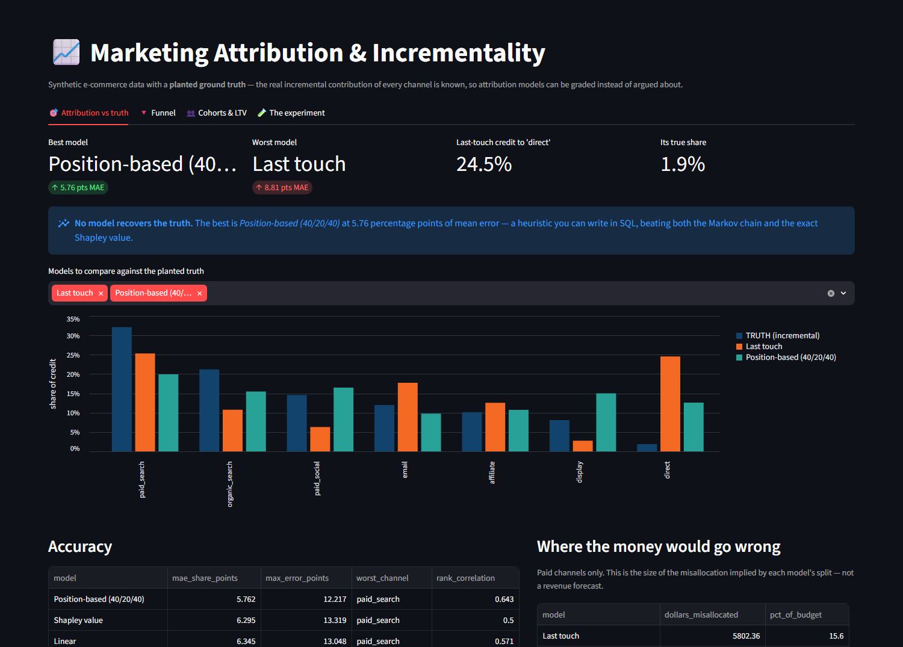
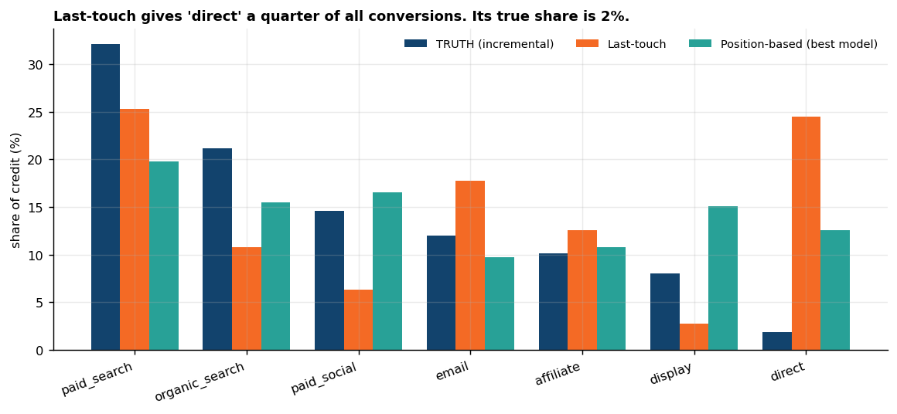
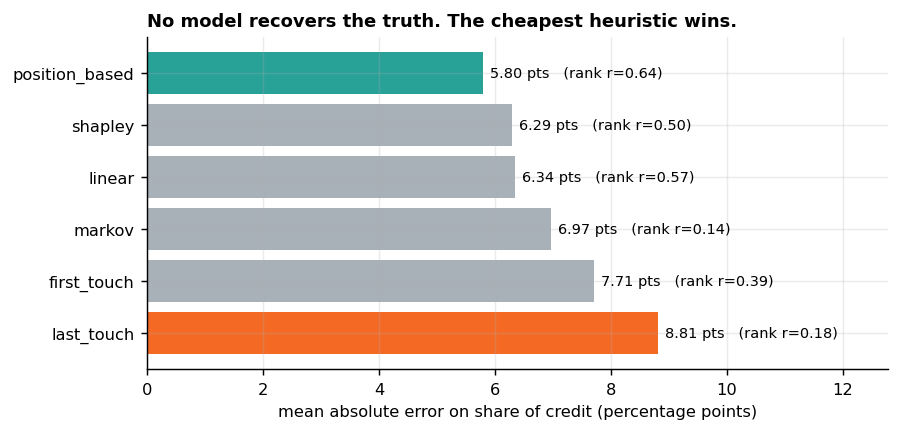
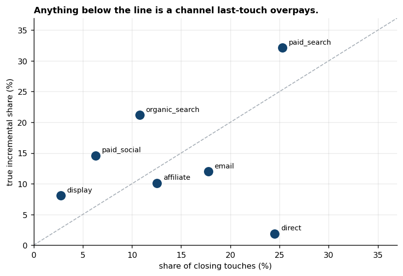
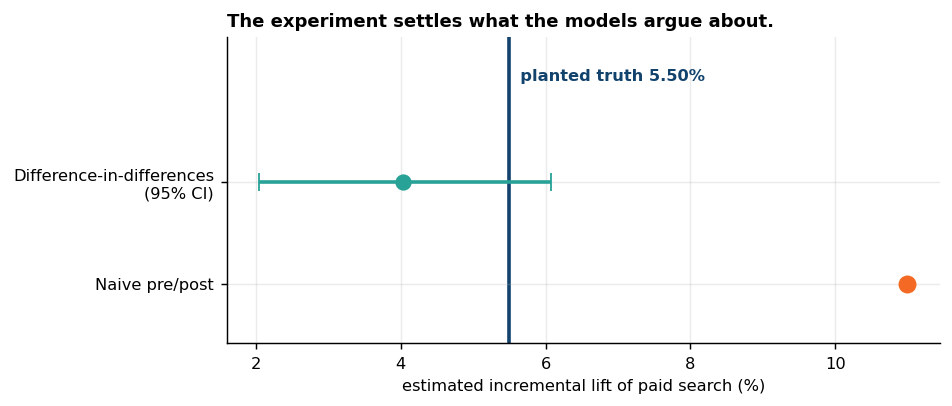
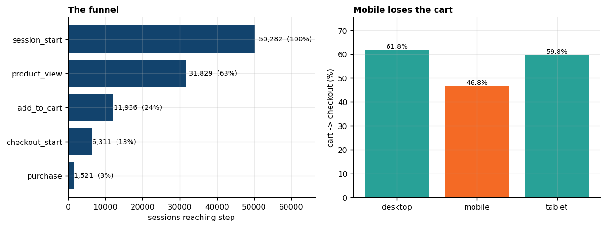
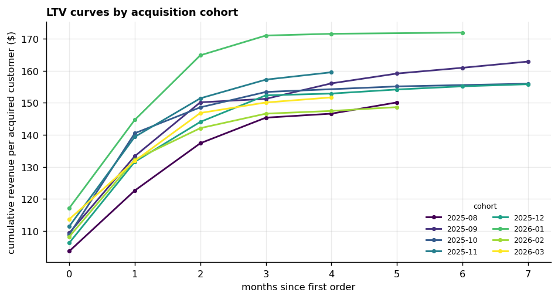

# 📈 Marketing Attribution & Incrementality

### *Every attribution debate I have ever sat in was unfalsifiable, because nobody in the room knew the right answer. So I built a dataset where I do.*

[](https://github.com/KushPatel29/marketing-attribution-analytics/actions/workflows/ci.yml)


**All data is synthetic** — 14,000 user journeys, 50,282 sessions, 101,879 funnel
events, 2,169 orders, generated from a fixed seed. No real company, customer,
campaign, or spend figure appears anywhere.

---

## The problem with every attribution deck

Marketing attribution is the only analytics discipline I know of where the
industry argues endlessly about the answer and *nobody can check it*. Last-touch
says paid search won. First-touch says display won. The agency's Markov model
says whatever justifies the retainer. All three are unfalsifiable, because the
counterfactual — *would this customer have bought anyway?* — is not in the data.

So the first thing this repo builds is not a model. It is a **ground truth**.

Each user's conversion is drawn from a noisy-OR over the channels that actually
touched them:

```
p(convert) = 1 - (1 - baseline) * PROD_c (1 - lift_c) ^ min(touches_c, cap)
```

Every user gets one uniform draw `u` and converts when `u < p`. Then, holding
**the same draw fixed**, I recompute `p` with one channel's touches deleted and
ask whether that user still converts. The ones who stop converting are that
channel's true incremental contribution.

That is the experiment no marketing team can run on live traffic. Here it costs
four seconds of CPU, and it means every model below can be *graded* instead of
argued about.

## The planted trap

One row in [`config.py`](config.py) does most of the work:

| channel | true lift | opens journeys | closes journeys |
|---|---|---|---|
| paid_search | 0.055 | often | very often |
| email | 0.045 | rarely | often |
| organic_search | 0.035 | often | sometimes |
| affiliate | 0.030 | rarely | sometimes |
| paid_social | 0.020 | very often | rarely |
| display | 0.010 | very often | almost never |
| **direct** | **0.005** | **rarely** | **most of all** |

`direct` has the highest closing weight and the lowest causal effect, because
"direct" is not a channel. It is a label for demand that something else created
— the customer who saw the ad on Tuesday and typed the URL on Friday.

Everything that follows is the consequence of that one row.

## What the models got wrong



*The console. Pick any models and compare them against the truth; the accuracy
and budget tables update with them.*



**Last-touch hands `direct` 24.5% of all conversions. Its true share is 1.9% — a
13-fold overcredit**, and it is the single largest error any model makes.



| model | mean abs. error (share points) | rank correlation with truth |
|---|---|---|
| **Position-based (40/20/40)** | **5.76** | **0.64** |
| Shapley value (exact) | 6.30 | 0.50 |
| Linear | 6.35 | 0.57 |
| Markov removal effect | 6.97 | 0.14 |
| First-touch | 7.71 | 0.39 |
| Last-touch | 8.82 | 0.18 |

**No model recovers the truth, and the two sophisticated ones lose to a
heuristic you can write in SQL in ten minutes.** The exact Shapley value — 128
coalitions, no approximation — comes fourth. The Markov chain comes fifth, and
its rank correlation of 0.14 means it barely orders the channels better than
chance.

I did not expect that, and I spent a while looking for the bug. There isn't one.
The reason is structural, and it is the most useful thing in this repo:

> **Every observational model reads how often a channel is *present*. None of
> them can see whether it *caused* anything.** In this data, presence and effect
> are deliberately decoupled — display is everywhere and does almost nothing,
> email is rare and does a lot. A model whose only input is the journey log
> cannot tell those apart, no matter how much maths you put on top.

Markov's removal effect fails hardest precisely because it is the most confident
about causality. Deleting a high-volume node from the graph tears out a lot of
paths, so display and direct score high on removal effect for the same reason
they score high on last-touch: there is simply a lot of them.



`direct` closes **63%** of its own touches. `display` closes **3%** of its 1,275.
Neither number has anything to do with what they contributed.

## The nuance I refuse to drop

Last-touch is the worst model in the table. It is also, if you only use it to
split **paid** budget, the *least* damaging:

| model | paid budget misallocated | % of budget |
|---|---|---|
| **Last-touch** | **$5,802** | **15.6%** |
| Position-based | $6,494 | 17.5% |
| Shapley | $7,576 | 20.4% |
| Linear | $7,723 | 20.8% |
| Markov | $8,320 | 22.4% |
| First-touch | $11,349 | 30.5% |

Last-touch's catastrophic error is on `direct` — a channel nobody can buy. Strip
the unbuyable channels out and the model that looks worst on paper is the one
that misallocates the least real money.

Both numbers are here because reporting only the first one is how you win an
argument and lose the decision. A test
([`test_last_touch_ranks_better_on_budget_than_on_share`](tests/test_attribution.py))
enforces that this stays true, so the claim cannot rot.

## The part that actually measures causality

If no observational model can see causality, you have to go and create some.

I ran a **geo holdout**: paid search switched off in 10 of 20 DMA-style geos for
eight weeks, against eight weeks of pre-period, 1.77M sessions in total.



| | estimate | vs. truth (5.50%) |
|---|---|---|
| Naive pre/post on the holdout | **11.00%** | 2× overstated |
| **Difference-in-differences (within-geo)** | **4.04%**, 95% CI **2.05% – 6.08%** | **interval covers the truth** |

The naive readout is not a strawman — it is what gets presented. Both arms fell
together on a seasonal downswing, and comparing the holdout only to its own past
charges all of that to the channel.

Three design decisions carry the readout, and each is a test:

1. **Power was computed before the result, not after.** At this traffic the test
   can detect a 2.99% relative lift. Paid search (5.5%) is testable. **Paid
   social is not** — its effect is 8 basis points on the conversion rate, which
   needs ~967,000 sessions per arm. The repo says so out loud rather than
   running the test and reporting a null as a finding.
2. **Normalise within geo before comparing arms.** Geos differ in baseline
   conversion by more than the effect being measured; pooling raw rates buries a
   5% signal under a 40% spread in geo quality.
3. **Bootstrap over geos, not sessions.** The geo is the randomised unit.
   Resampling sessions would pretend 6,000 sessions in one geo are 6,000
   independent decisions and shrink the interval to a lie. The consequence —
   that you widen a geo test by adding *geos*, not traffic — is itself a test
   ([`test_interval_narrows_with_more_geos`](tests/test_incrementality.py)).

And the estimator is validated in both directions: it recovers a planted 8%
effect, and when there is **no** effect it returns nothing and its interval
covers zero. A method you have only ever seen find something is not a method.

## Why even a perfect model would be wrong

Incremental credit **does not sum to the number of conversions**. A customer who
needed both the email and the paid-search click is counted as incremental for
both — removing either one alone loses the sale. Attribution models must split
each conversion into shares totalling 100%, so they are answering a subtly
different question than the business is asking.

That gap is irreducible. It is why
[`test_no_model_is_suspiciously_perfect`](tests/test_attribution.py) asserts a
*floor* on the error: a model scoring near zero would mean the ground truth had
leaked into the harness, not that someone had built something brilliant.

## The rest of the analysis

The attribution story is the headline, but a marketing analyst spends most of
their week on the funnel and the cohorts.



| step | sessions | step conversion |
|---|---|---|
| session_start | 50,282 | — |
| product_view | 31,829 | 63.3% |
| add_to_cart | 11,936 | 37.5% |
| checkout_start | 6,311 | 52.9% |
| purchase | 1,521 | 24.1% |

Cut by device, one step moves and the others don't: **cart → checkout runs 46.8%
on mobile against 61.8% on desktop — 15.1 points, on the majority of the
traffic.** That is a product bug with a revenue number attached, and it is the
kind of finding a funnel exists to produce.



Cohorts are cut by first-order month, with a retention triangle and a cumulative
revenue-per-customer curve, both computed with window functions in
[`sql/03_cohorts_ltv.sql`](sql/03_cohorts_ltv.sql).

## The SQL is the deliverable

Everything in `sql/` runs **as written** against SQLite.
[`engine/run_analytics.py`](engine/run_analytics.py) loads the CSVs and calls
`executescript` on those exact files — there is no Python re-implementation that
happens to resemble them. A test
([`test_committed_sql_is_what_runs`](tests/test_sql_analytics.py)) fails if any
exported table stops being created by a `CREATE TABLE` in `sql/`.

| file | what it does |
|---|---|
| [`01_schema.sql`](sql/01_schema.sql) | Reference DDL for the star |
| [`02_funnel.sql`](sql/02_funnel.sql) | Funnel with `LAG` step conversion, by device and by entry channel |
| [`03_cohorts_ltv.sql`](sql/03_cohorts_ltv.sql) | Cohorts, retention triangle, cumulative LTV via window frames |
| [`04_channel_efficiency.sql`](sql/04_channel_efficiency.sql) | Spend, CPA, ROAS — aggregate-then-join |
| [`05_attribution_heuristics.sql`](sql/05_attribution_heuristics.sql) | First / last / linear / position-based, one pass |

Two bugs the tests caught while I was writing them, both worth naming:

- **Spend fan-out.** Spend is at `(date, channel)`; sessions are at `(session)`.
  Joining them directly multiplies cost by the number of sessions and inflates
  spend by four orders of magnitude. This is the most common wrong number in
  marketing dashboards, and
  [`test_spend_is_not_fanned_out_by_the_join`](tests/test_sql_analytics.py) ties
  total spend to the source to the cent.
- **Position-based lost 20% of every two-touch conversion.** The 40/20/40 split
  has no middle touch to give the 20% to when a journey has exactly two, so it
  silently credited 0.8 of a conversion and every downstream share was wrong.
  A test that each model's credit sums to the conversion count caught it. It now
  splits 50/50.

## Run it

```bash
pip install -r requirements.txt
python data_generator/generate_marketing_data.py   # data + ground truth
python engine/run_analytics.py                     # runs sql/ verbatim
python attribution/evaluate.py                     # the bake-off
python experiments/incrementality.py               # the geo holdout
python analytics/make_visuals.py                   # docs/ charts
python -m pytest -q                                # 56 tests
streamlit run app/streamlit_app.py                 # the console
```

CI runs all of it on every push, and additionally regenerates the dataset on
Linux and `git diff --exit-code`s it against the CSVs committed from Windows —
if the pipeline is not byte-reproducible across platforms, the build fails.

## Things I deliberately didn't build

- **A media mix model.** MMM answers a genuinely different question (channel
  effect at the *aggregate* level, over years, with adstock and saturation) and
  needs several years of weekly spend to fit. On twelve months of one
  advertiser's data it would be a curve-fitting exercise dressed as causality —
  which is the exact failure mode this repo was built to expose.
- **A neural or LSTM attribution model.** With seven channels and 3.6 touches
  per journey there is no sequence structure deep learning could find that the
  Markov chain cannot. And the Markov chain already lost, for reasons no amount
  of model capacity fixes.
- **Shapley by Monte Carlo.** Seven channels is 128 coalitions. The exact value
  is a fraction of a second, so sampling would add variance to a number I can
  simply compute.
- **A cookie/identity-resolution layer.** Real journey stitching is a hard,
  important, and completely different problem. Pretending to solve it with
  synthetic user IDs that are correct by construction would be theatre.
- **Statistical significance stars on the attribution table.** The shares are
  point estimates from one simulated world. Decorating them with p-values would
  imply an inferential claim the design does not support.

## What I'd say about this in an interview

That the useful output of an attribution project is usually not the model. It's
finding out that a quarter of your credited conversions are going to a channel
you can't buy, that the fancy model is worse than the cheap one, and that the
only way to actually settle it costs eight weeks and one switched-off region.

---

*Part of a portfolio of tested analytics projects —
[github.com/KushPatel29](https://github.com/KushPatel29)*
